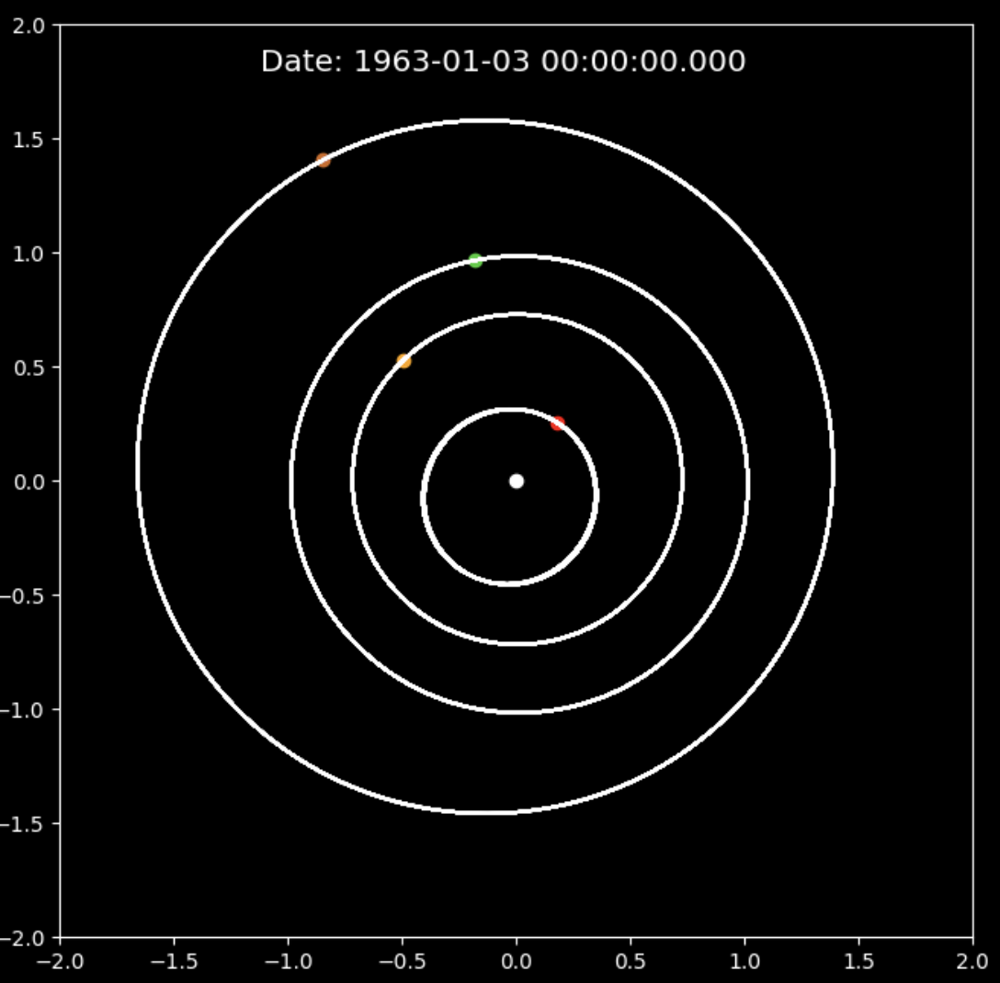
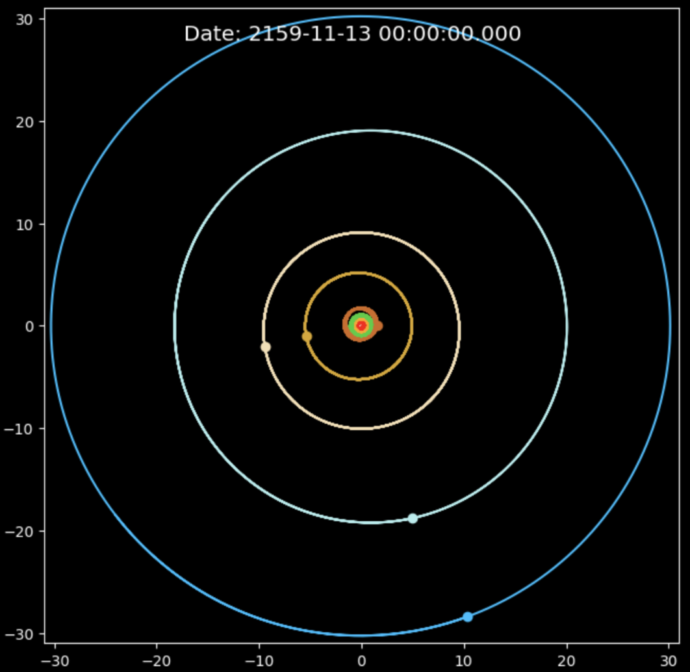

# Solar System Simulator

Final project for PHYS 246: Computational Physics

This is a working simulation of our solar system in real time using initial conditions from NASA and time-evolving them with a 2D Euler integrator. I've created two animations: one containing the terrestrial planets and another containing all 8 planets. Snapshots of the final positions of the planets with their trajectory lines are also included:

## Astroquery and data formatting
To find the initial conditions of the trajectories of our planets, I used the [astroquery](https://astroquery.readthedocs.io/en/latest/jplhorizons/jplhorizons.html) package to search for the data from the [JPL Horizons On-Line Ephemeris System](https://ssd.jpl.nasa.gov/horizons/) on the position and trajectory of the celestial bodies.

After grabbing the initial conditions, the simulation itself is just a simple 2-dimensional first-order (Euler) integrator.

* **Time:** There's a YYYY-MM-DD string that represents the initial time of the simulation that we will use to get the initial conditions of the planets. This is done for readability purposes--the actual time used in Horizons is in Julian Date format, which we calculate by converting the YYYY-MM-DD string using `astropy.time`. For this demo, we begin in January 1, 1960 (1960-01-01), the earliest UTC time.

* **State Vector:** To get the position and velocity of the celestial body at its given epoch, also known as the state vector, we initialize the `Horizons` object (with the ID of the planet, the chosen origin of our coordinate system, and the start time calculated earlier) and simply call `vectors()` on it. To demonstrate the metadata given in the state vector, we print out its columns.

Here, 'x/y/z' (AU) and 'vx/vy/vz' (AU/day) are the positions and velocities. This is the only information we need.

## A note on acceleration and relevant constants

This is the gravitational acceleration applied to the position vector of a planet

$$\vec{a_r} = - \frac{GM_\odot \vec{r}}{(||\vec{r}||^2)^{3/2}}$$

Because the state vector's position and time is measured in AU and days, we must rewrite $G$ as:

$$G = 6.673 \times 10^{-11} \frac{m^3}{kg s^2} \times (\frac{1 AU}{1.4960\times10^{11} m})^3 \times (\frac{86400 s}{1 d})^2$$

$$G = 1.487831774 \times 10^{-34} \frac{AU^3}{kg d^2}$$

Noting that $M_\odot = 1.989 \times 10^{30} kg$, we can then define a constant

$$GM = GM_\odot = 1.487831774 \times 10^{-34} \frac{AU^3}{kg d^2} \times 1.989 \times 10^{30} kg$$

$$ GM = 2.95929739849 \times 10^{-4} \frac{AU^3}{d^2}$$

Which is what we use in our step function.